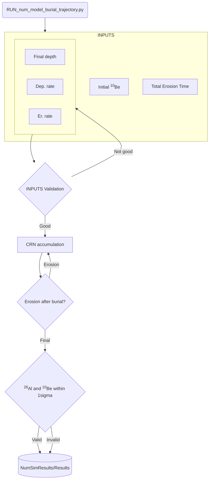

```mermaid
flowchart 
    RUN(RUN_num_model_burial_trajectory.py) --> INPUTS
    subgraph INPUTS [INPUTS]
        A[Initial <sup>10</sup>Be]
        T[Total Burial Time]
        T[Total Erosion Time]

        subgraph PARAMS [ ]
            FD[Final depth]
            DR[Dep. rate]
            ER[Er. rate]
        end
    end

    PARAMS --> V{INPUTS Validation}

    V -->|Good| B
    V -->|Not good| PARAMS

    B[CRN accumulation]
    
    B --> F{Erosion after burial?}
    
    F -->|Erosion| B
    F -->|Final| E
    
    E{<sup>26</sup>Al and <sup>10</sup>Be within 1sigma}
    
    E -->|Valid| STORE
    E -->|Invalid| STORE
    
    STORE[(NumSimResults/Results)]
        
```